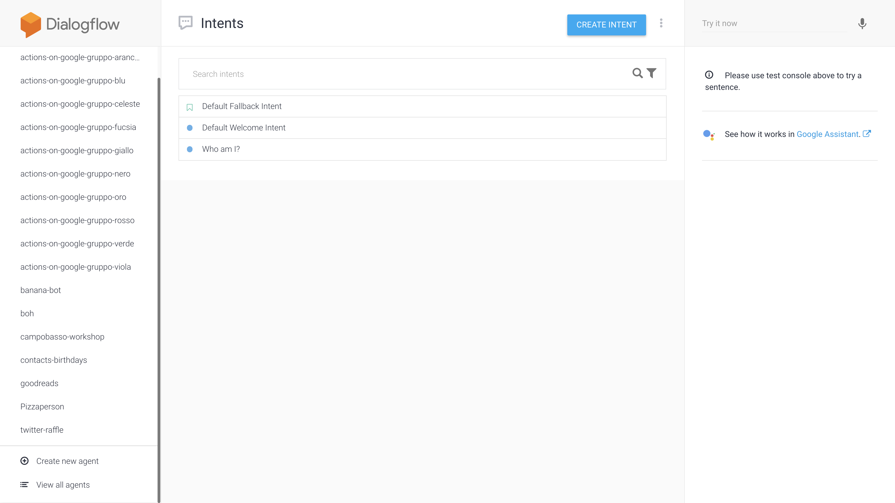
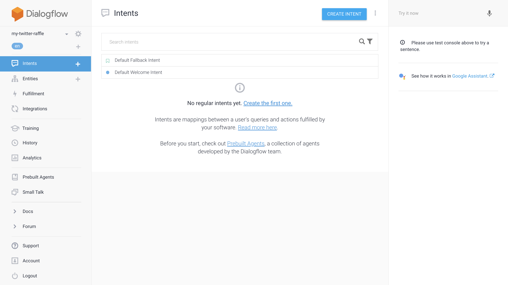
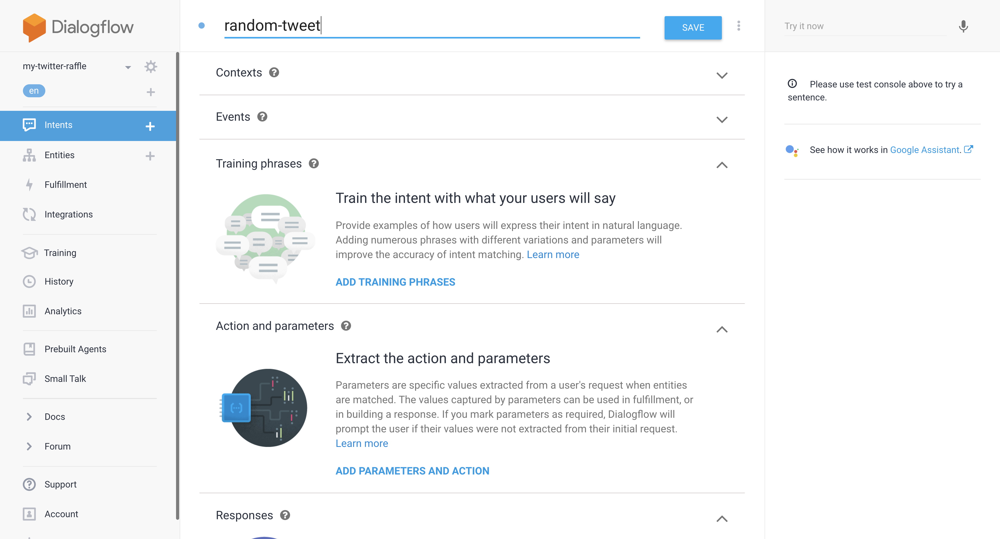
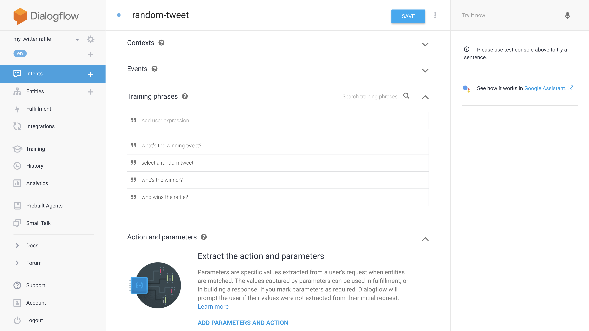
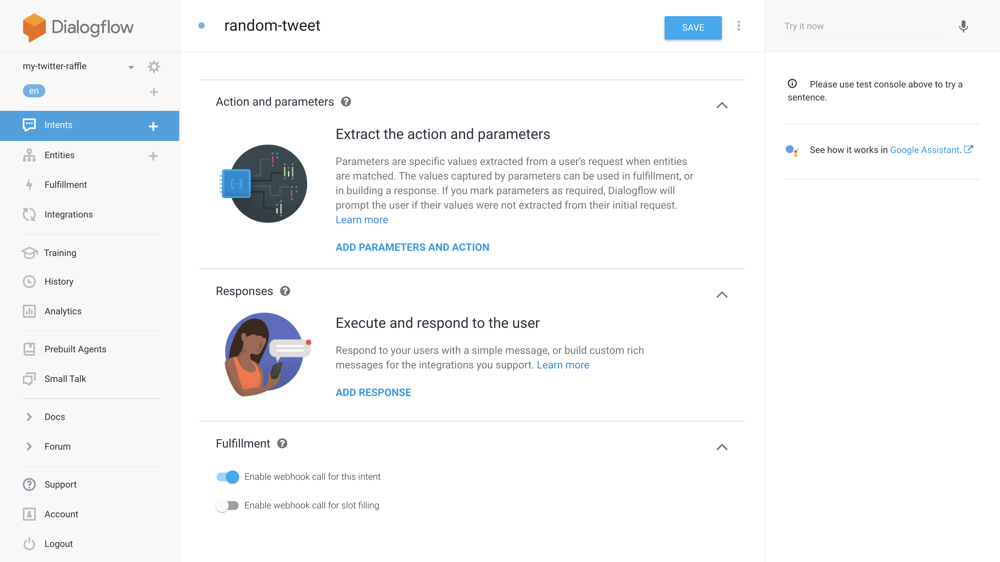

# Dialogflow Agent creation

In the first step, we'll configure a Dialogflow project so that it can answer
to prompts like:

> select a random tweet

Or:

> who wins our raffle?

## Accessing Dialogflow

Go to https://console.dialogflow.com/ and login with your Google credentials.

From the top right dropdown menu, select "Create new agent":

Create a new agent, and give it the name you want. A good name could be
"my-twitter-raffle".

As soon as the project is created, you'll be redirected to the Intents page:

From here, click on the top right button "Create Intent".

## Creating your first Intent

In this first step, you won't need to write a single line of code, as the entire
configuration can be handled through a visual interface.

An Intent, in Dialogflow, is an entry point for our Agent.

So let's name our Intent, shall we? Since this Intent will answer to our random
tweet selection prompt, let's call it `random-tweet`.

You are free to give your Intent any name you wish, but please make sure that
the name clearly represents the operation it has to perform. When you start
adding more and more Intents to your Agent, it might be difficult to find the
Intent you're looking for, if you haven't given them clear names.

We can now save your Intent from the "Save" button in the top right corner.

## Adding Training phrases

By expanding the section "Training phrases", you can add the sentences that will
in fact invoke the Intent, for instance:

> select a random tweet

or:

> who wins our raffle?

You can add any phrase you want, as long as it is semantically compatible with
the Intent you're configuring 😉.

Dialogflow will learn from the sample phrases you just added, and will be able
to answer to different requests with the same meaning, like:

> could you please tell me who's the winner?

Once you added all your sample training phrases, save the Intent once again.

## Enabling the Fulfillment

By default, every Intent can answer with a random reply among the ones defined
in the Intent "Responses" section. What we need, instead, is to execute a remote
operation, and only afterwards to give an actual answer to the user, saying that
the operation has been performed with success (or failure).

We need to implement some minimum logic to:
1) recognise which Intent was triggered
2) process the command
3) answer back to the user

This process is called, on Dialogflow, "Fulfillment".

For the Intent we just created, you need to expand the "Fulfillment" section and
click on "Enable fulfillment". Once the section is expaned, you need select the
option "Enable webhook call for this intent".

And once more, please save your Intent.

## Next step

Congratulations!

You completed the first step of the tutorial!
Head over to the [next step](02-fulfillment.md) to configure the fulfillment
using (some) Javascript code.
