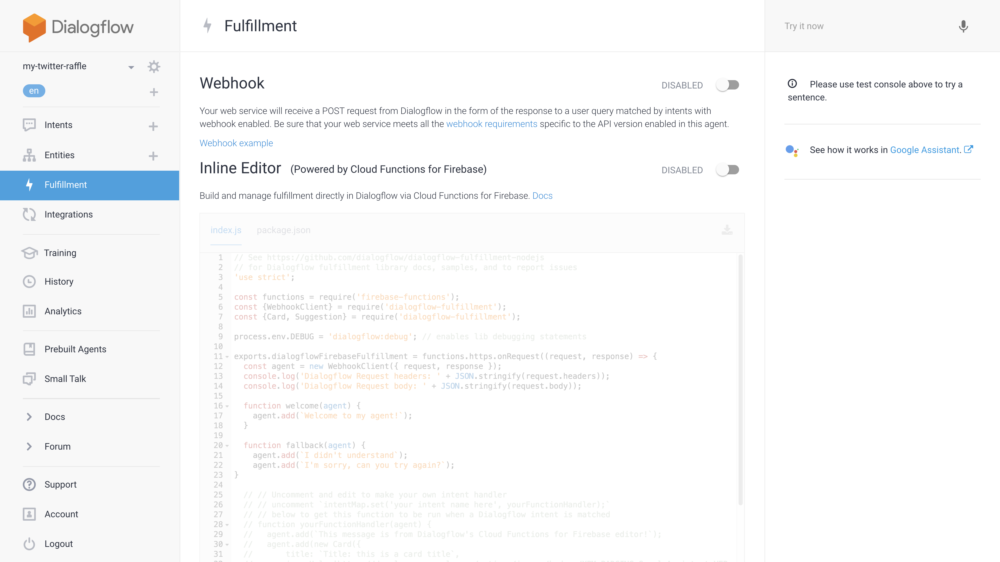
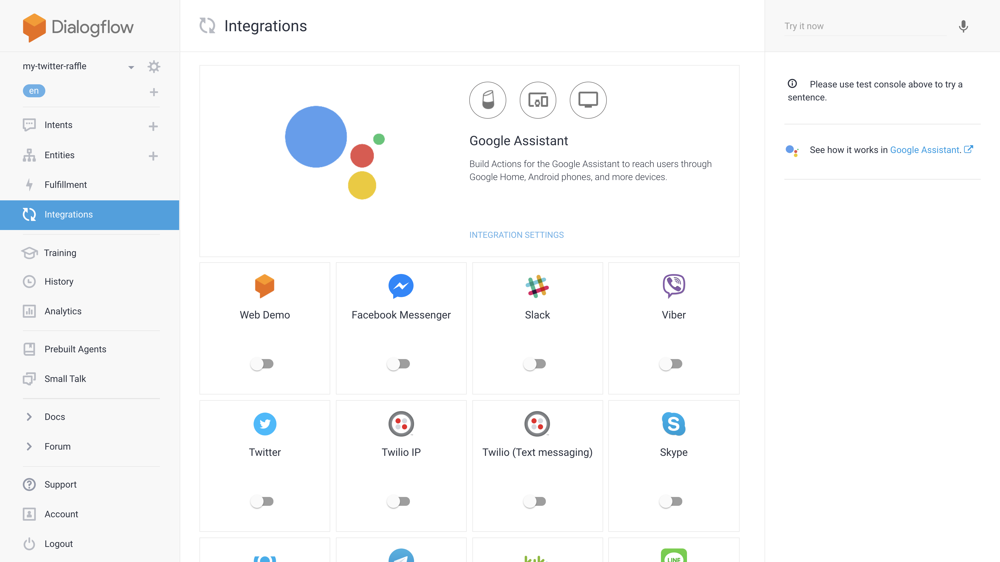
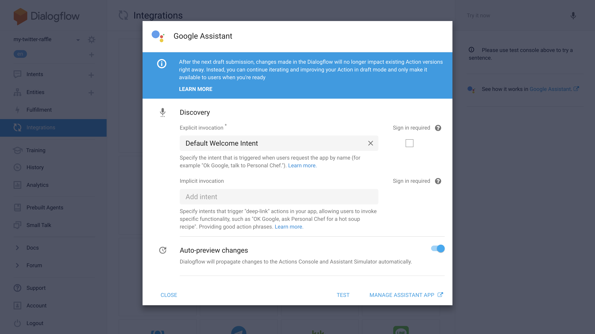
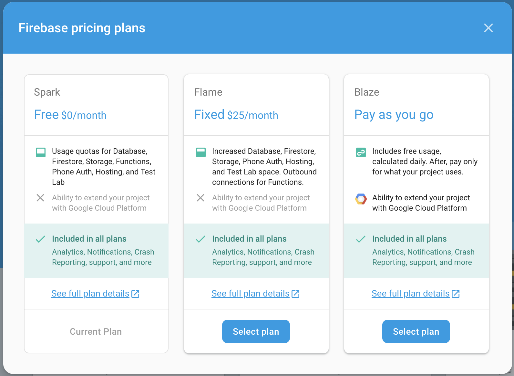

# Fulfilment on Firebase Functions

In the second step of this tutorial, you'll learn how to make a simple
fulfillment for Actions on Google, using the Dialogflow integrated editor
(no other software required!).

## Enabling fulfillment

Even if we already enabled the fulfillment for our Intent, we now need to
specify, on a project level, which Web service will reply to the requests coming
from Dialogflow.

In the left sidebar click on "Fulfillment". You will see the following screen:



Please enable the second option, "Inline Editor". This will allow you to write
the fulfillment code right into the browser, without the need for any other IDE.

### Firebase Cloud functions

Firebase Cloud Functions is a Firebase service that allows you to handle Web
requests in an easy and fast way. Our implementation uses Javascript.

Cloud Functions work by exporting a function, in our case called
`dialogflowFirebaseFulfillment`, that will be directly handled by our Actions on
Google SDK app.

The Actions on Google SDK can read Web requests, extract its arguments and reply
in any way.

## Writing your fulfillment

The inline editor expects you to specify two files:

* `index.js`, the file containing the actual NodeJS
* `package.json`, the file containing the dependencies, and something more

### `package.json`

Copy the following content into the `package.json`:

```json
{
  "name": "dialogflowFirebaseFulfillment",
  "description": "This is the default fulfillment for a Dialogflow agents using Cloud Functions for Firebase",
  "version": "0.0.1",
  "private": true,
  "license": "Apache Version 2.0",
  "author": "Google Inc.",
  "engines": {
    "node": "~6.0"
  },
  "scripts": {
    "start": "firebase serve --only functions:dialogflowFirebaseFulfillment",
    "deploy": "firebase deploy --only functions:dialogflowFirebaseFulfillment"
  },
  "dependencies": {
    "actions-on-google": "^2.2.0",
    "firebase-admin": "^5.12.1",
    "firebase-functions": "^0.5.7",
    "query-string": "^6.1.0",
    "twitter": "^1.7.1"
  }
}
```

This configuration specifies the dependencies we need, including the Twitter
library for NodeJS.

### `index.js`

Copy the following skeleton code into the `index.js` panel:

```js
'use strict';

const functions = require('firebase-functions');
const {dialogflow} = require('actions-on-google');
const Twitter = require('twitter');
const queryString = require('query-string');

const app = dialogflow();

// we will edit this function to select a random tweet, and reply back to the user
const randomTweetFulfillment = (conv) => {
    conv.ask('This is a default response');
};

app.intent('random-tweet', randomTweetFulfillment);

exports.dialogflowFirebaseFulfillment = functions.https.onRequest(app);
```

As you can see, we're specifying, for our `app`, that the Intent we created
before, `random-tweet`, will be handled by the function
`randomTweetFulfillment`.

All Intent handlers accept a `Conversation` object, allowing you to continue
the conversation with the user.

In the sample code we added, we are simply replying back to the user with:

> This is a default response

### Deploying the fulfillment

We can now click on the "Deploy" button and wait for the function to be deployed
and available on Firebase.

## Test your Action

To test our first iteration of the action, let's open the "Integrations" section
in the left sidebar. Once opened, we'll see this screen:



Click on the big "Google Assistant" top panel, and select the bottom
"Auto-preview changes":



Then, clicking on "Test" will redirect us to the Actions on Google "Simulator",
where we can start the conversation by opening our agent with:

> Talk to my test app

(If you want to change the name of your Google Assistant Action, you can do so in
the Actions on Google "Invocation".)

Play along with the simulator asking "who wins?" or similar sentences, and it
should reply back with:

> This is a default response

## Extracting one random Tweet

To extract one random tweet, let's go back to the Dialogflow Fulfilment code,
and let's add the following class *before* the definition of `app`:

```js
class TwitterFetcher {

  constructor(config) {
    this.client = new Twitter({
      consumer_key: config.consumerKey,
      consumer_secret: config.consumerSecret,
      access_token_key: config.accessTokenKey,
      access_token_secret: config.accessTokenSecret
    });
  }

  selectTweet(query) {
    const fromYesterday = new Date();
    fromYesterday.setDate(fromYesterday.getDate() - 1);
    let tweets = [];

    const getTweets = (after) => {
      return this.client
        .get(
          'search/tweets',
          {
            q: query,
            result_type: 'recent',
            include_entities: false,
            count: 100,
            max_id: after
          }
        )
        .then((result) => {
          const tweetsFromYesterday = result.statuses
            .map((tweet) => {
              tweet['created_at'] = new Date(tweet['created_at']);
              return tweet;
            })
            .filter((tweet) => {
              return tweet['created_at'] >= fromYesterday;
            });
          tweets = tweets.concat(tweetsFromYesterday);
          return result;
        })
        .then((result) => {
          const metadata = result['search_metadata'];
          const nextResults = queryString.parse(metadata['next_results']);

          if (nextResults['max_id']) {
            return getTweets(nextResults['max_id']);
          }

          return tweets;
        });
    };

    const randomFromZeroTo = (maxNumber) => {
      return Math.floor(Math.random() * maxNumber);
    };

    return getTweets()
      .then((tweets) => {
        if (!tweets.length) {
          console.log('No tweets found');
          return undefined;
        }

        console.log(`Selecting a tweet among ${tweets.length} tweets found...`);
        return tweets[randomFromZeroTo(tweets.length)];
      });
  }
}
```

This class has the logic for searching for tweets and extracting one randomly.

## Connecting to Twitter

To be able to access the Twitter API, you must create a Twitter app by visiting
the Twitter page: https://apps.twitter.com/app/new.

Here, add the name of your app ("Random Tweet Extractor" or whatever you want),
and the rest of the required information.

When you're done, you will be redirected to your application page. Go into the
"Keys and Access Tokens" tab and make a note of the following:

* Consumer Key (API Key)
* Consumer Secret (API Secret)
* Access Token
* Access Token Secret

These values will be needed to create our own instance of the `TwitterFetcher`
class we recently added into the code, and are needed to authorise our Twitter
API calls.

## Searching for tweets

Let's go back to our function in the "Inline Editor", and let's replace the
implementation of `randomTweetFulfillment` with the following code, making sure
to use the proper API keys we just retrieved from the newly created Twitter app:

```js
const randomTweetFulfillment = (conv) => {
    const twitterFetcher = new TwitterFetcher({
        consumerKey: `Consumer Key (API Key)`,
        consumerSecret: `Consumer Secret (API Secret)`,
        accessTokenKey: `Access Token`,
        accessTokenSecret: `Access Token Secret`
    });

    return twitterFetcher
        .selectTweet('#ActionsOnGoogle')
        .then((winner) => {
            conv.close(`Our winner is @${winner.user.screen_name} with the tweet:\n${winner.text}`, 'Congratulations!')
        })
        .catch(error => {
            conv.ask('Sorry, there was a problem selecting a winner. Please try again.');
            console.error(error);
        });
};
```

Deploy your function, and the coding will be over!

What does this snippet of code do?

1. It creates an instance of `TwitterFetcher`, using the API keys that Twitter
  gave us.
2. It selects tweets containing `#ActionsOnGoogle` (but you can change this to
  whatever you want).
3. When it finds a winner, it closes the conversation by communicating the
  result.
4. If it fails, it tells the user that there was a problem.

### What are Promises

`Promise`s are a Javascript specification to handle asynchronous code in an
easier way than with callbacks.

A Promise object has the following methods, that allow it to be chained:
* `then`, to specify what happens *after* the asynchronous operation has
completed with success
* `catch`, to specify what happens if the asynchronous operation fails

In our case the asynchronous operation is, of course, the network call that is
needed to perform a Twitter search and extract a winner. For this reason we
communicate the result in the `then` handler, and the failure in the `catch`.

If you want more information about Promises, you can read
[this article](https://developers.google.com/web/fundamentals/primers/promises).

### A note on Firebase Cloud Functions

Our Firebase Cloud Function will perform a network request to Twitter. Any
network requests outside of Firebase are not possible for free accounts, so
testing our Action will fail!

Going back to the Fulfillment section in Dialogflow, in fact, we'll see a
message on the bottom saying:

> Billing account not configured. External network is not accessible and quotas
are severely limited. Configure billing account to remove these restrictions.

A button that says "Upgrade" will appear. Clicking on it, you will see 3
options:



Click on the "Pay as you go" and don't worry: for the test purposes of our app,
your account won't be billed, as it will fall in the grace free quota everyone
has.

## Final result

At this point, testing the Action in the Simulator should give the wanted
results.

*Congratulations!*

You completed this codelab! I now suggest you click [here](03-improvements.md)
to learn how you can improve your Action with more features that Action on
Google gives you.
